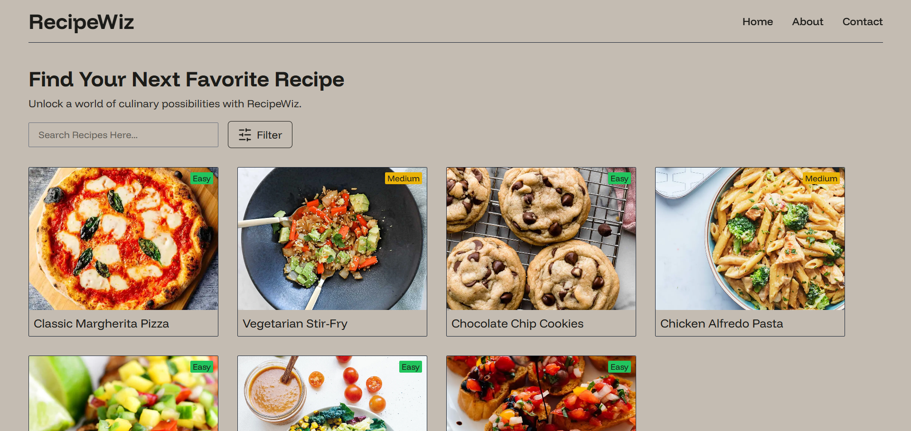

# RecipeWiz | A Recipe Application

RecipeWiz is a dynamic and responsive recipe discovery app built with React.js. It allows users to search, filter, and explore a wide variety of recipes based on cuisine, meal type, time, difficulty, and more. Perfect for food enthusiasts who want to try new dishes or find something that fits their schedule and skills.

---


## Features



-   **Recipe Search**: Easily search for recipes by name.
-   **Filters**: Refine your search using filters such as:
    -   Cuisine (e.g., Italian, Mexican, Indian)
    -   Meal Type (e.g., Breakfast, Lunch, Dinner)
    -   Cooking Time (e.g., Under 15 mins, Under 30 mins, etc.)
    -   Difficulty Level (e.g., Easy, Medium, Hard)
-   **Pagination**: View recipes in a paginated format, 7 recipes per page.
-   **Responsive Design**: Optimized for both desktop and mobile devices.

---


## Installation

### Clone the repository

```bash
git clone https://github.com/alok-x0s1/Recipe-Wiz.git
cd Recipe-Wiz
```

### Install dependencies

```bash
npm install
```

### Run the application

```bash
npm start
```

Visit `http://localhost:5173` in your browser.

---


## Usage 🔍

Once the app is running, you can:

-   **Search** for recipes by entering keywords into the search bar.
-   **Filter** recipes by selecting options like cuisine, meal type, time, and difficulty from the filter modal.
-   **Navigate** through the paginated list of recipes and click on any recipe to view more details.
-   **Reset** the filters to return to the default state.

---

## Technologies Used 🛠️

-   **React.js**: JavaScript library for building user interfaces.
-   **Tailwind CSS**: A utility-first CSS framework for rapid UI development.
-   **Lucide**: A library of customizable icons used for buttons and navigation.
-   **React Router**: Used for navigation between different pages of the app.
-   **React Context API**: Used to manage and share the recipe data across components.

---

## Contributing 🤝

If you'd like to contribute to **RecipeWiz**, follow these steps:

1. Fork the repository.
2. Create a new branch (`git checkout -b feature-branch`).
3. Make your changes.
4. Commit your changes (`git commit -m 'Add new feature'`).
5. Push to the branch (`git push origin feature-branch`).
6. Open a pull request.

## Contact 📧

For any questions or issues, feel free to reach out:

-   **GitHub**: [@alok-x0s1](https://github.com/alok-x0s1)
-   **Email**: [alok_421yadav](mailto:alok421yadav@gmail.com)
